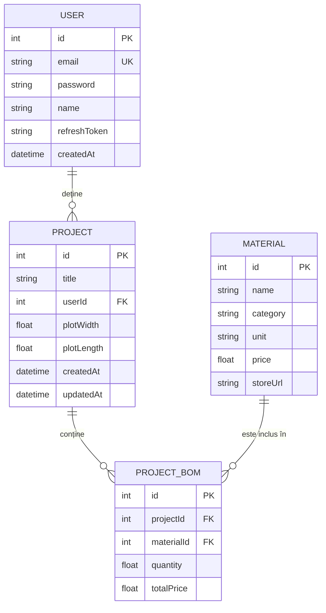

# Schema Bazei de Date - BuildWise

Sistemul folosește **PostgreSQL** administrat prin **Prisma ORM**. Mai jos este detaliată structura tabelelor și relațiile dintre acestea.

## 1. Diagramă ER (Entity Relationship)

---

## 2. Detalii Tabele

### Tabel: `User`
Stochează informațiile de autentificare și profil ale utilizatorilor.
- `id`: Cheie primară (autoincrement).
- `email`: Adresa de email unică (folosită pt login).
- `password`: Hash-ul parolei.
- `refreshToken`: Token-ul de refresh activ pentru gestionarea sesiunilor.

### Tabel: `Project`
Reprezintă un proiect de construcție creat de un utilizator.
- `userId`: Cheie externă către `User`.
- `plotWidth` / `plotLength`: Dimensiunile terenului (opționale).

### Tabel: `Material`
Catalogul general de materiale de construcție.
- `category`: Categorisirea materialului (ex: Fundație, Zidărie, Acoperiș).
- `price`: Prețul unitar de referință.

### Tabel: `ProjectBOM` (Bill of Materials)
Este un tabel de joncțiune care definește devizul unui proiect specific.
- `projectId`: Legătura cu proiectul.
- `materialId`: Legătura cu materialul din catalog.
- `quantity`: Cantitatea necesară pentru proiectul respectiv.
- `totalPrice`: Cantitate * Preț Material (calculat la momentul adăugării).
