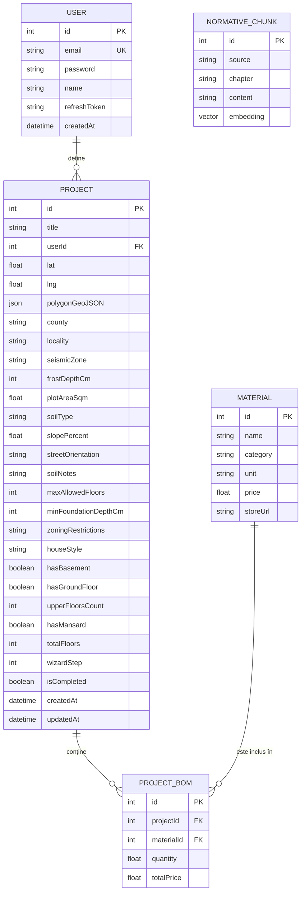

# Schema Bazei de Date - Zidario

Sistemul folosește **PostgreSQL** administrat prin **Prisma ORM**. Mai jos este detaliată structura actualizată a tabelelor și relațiilor dintre acestea, inclusiv suportul pentru similaritatea vectorială (RAG).

## 1. Diagramă ER (Entity Relationship)

---

## 2. Detalii Tabele

### Tabel: `User`
Stochează informațiile de autentificare și profil ale utilizatorilor.
- `id`: Cheie primară (autoincrement).
- `email`: Adresa de email unică (folosită pt login).
- `password`: Hash-ul parolei (bcrypt).
- `refreshToken`: Token-ul de refresh activ pentru gestionarea sesiunilor lungi.

### Tabel: `Project`
Reprezintă un proiect de construcție creat de un utilizator, stocând toți parametrii terenului și configurarea casei din Wizard.
- `userId`: Cheie externă către `User`.
- `county` / `locality` / `lat` / `lng`: Locația exactă a construcției.
- `polygonGeoJSON` / `plotAreaSqm`: Forma și suprafața terenului.
- `seismicZone` / `frostDepthCm`: Parametri automatizați pe baza județului (ex: "0.20g", 90).
- `soilType` / `slopePercent`: Detalii despre sol și înclinația terenului.
- `wizardStep` / `isCompleted`: Urmărește stadiul de completare al wizard-ului pe frontend.
- `totalFloors`, `hasBasement`, `upperFloorsCount`: Configurarea structurii clădirii.

### Tabel: `NormativeChunk` (Sistem AI - RAG)
Stochează fragmente de legislație în format text și ca vectori matematici pentru căutări AI.
- `source`: Documentul sursă (Ex: "P100-1/2013").
- `chapter`: Capitolul de unde face parte informația.
- `content`: Textul brut care va fi preluat de AI.
- `embedding`: Vector generat de Google GenAI (768 dimensiuni) cu **index `ivfflat`** pentru căutare similară ultrarapidă.

### Tabel: `Material`
Catalogul general de materiale de construcție.
- `category`: Categorisirea materialului (ex: Fundație, Zidărie, Acoperiș).
- `price`: Prețul unitar de referință.

### Tabel: `ProjectBOM` (Bill of Materials)
Este un tabel de joncțiune care definește devizul final al materialelor pe proiect.
- `projectId`: Legătura cu proiectul.
- `materialId`: Legătura cu materialul din catalog.
- `quantity`: Cantitatea necesară pentru proiectul respectiv.
- `totalPrice`: Cantitate * Preț Material.
