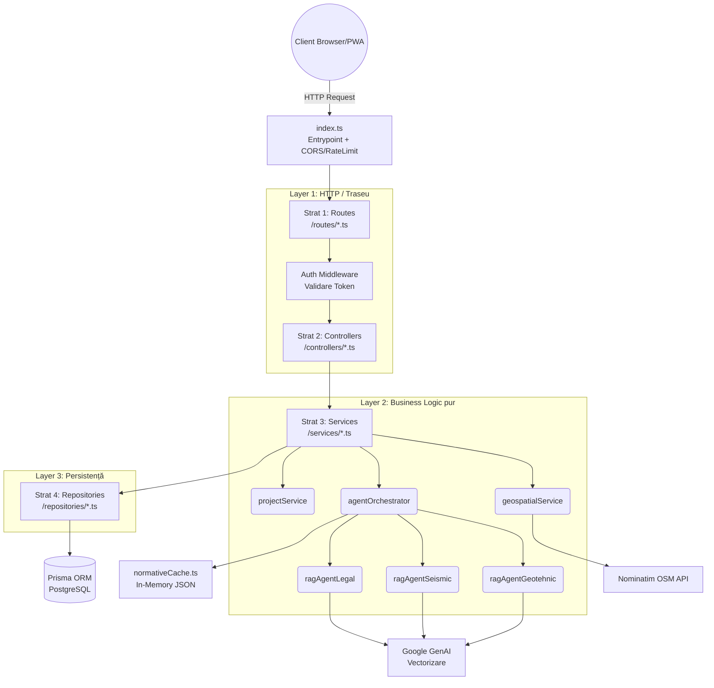

# Documentație: Faza 1 Implementată - Zidario

Acest document descrie stadiul actual al proiectului la finalizarea primei faze majore (Pregătire Teren și Configurare Casă). Detaliază arhitectura solidă a backend-ului, feature-urile deja dezvoltate, fluxul complet de viață al fișierelor și un exemplu de flow de utilizare.

---

## 1. Ce a fost implementat până acum

### 1.1. Autentificare & Securitate Avansată
- **Sistem Auth Complet**: Endpoint-uri pentru Register, Login, Refresh Token și Logout.
- **Securitate JWT**: Tokeni împărțiți pe durate logice - `accessToken` scurt (15 minute) returnat via JSON și un `refreshToken` (7 zile) trimis exclusiv într-un Cookie HttpOnly/Secure (protecție XSS).
- **Protecție Anti-Abuz (Rate Limiting Dual)**: 
  - `globalLimiter`: Limitează numărul maxim de request-uri la server, respingând orice flood sau spam.
  - `authEmailLimiter` & `authIpLimiter`: Strategie strictă pe logările eșuate care nu blochează utilizatorii nevinovați care împart același IP, dar oprește atacurile brute-force direcționate.
- **Headere Express**: Utilizarea middleware-ului `helmet` pentru headere sigure și setările de tip `cors`.

### 1.2. Setare Teren și Proiecte (Wizard 4 Pași)
- **Persistență și Structură DB (Prisma)**: O bază de date stabilă (PostgreSQL) complet scalabilă care captează detalii specifice construcției: județ, tip de sol, zonare seismică, prezență subsol, mansardă.
- **useProjectGuard (Resume/Sync)**: Hook custom care monitorizează `activeProjectId` în `localStorage`. Permite utilizatorului să închidă browser-ul și să revină exact la pasul și datele salvate anterior, sincronizând automat starea din DB cu formularul React.
- **Dual-Flow Location Selection (Step 1)**:
  - **Flux A (Stereo 70)**: Introducere coordonate X/Y din planul PAD cu conversie automată în GPS (via `proj4`) și vizualizare poligon pe hartă.
  - **Flux B (Manual/Search)**: Căutare inteligentă prin **Nominatim API**. Permite selectarea localității fără coordonate GPS precise, centrând harta automat.
- **Serviciu Geospatial & AI Extraction**: 
  - **Reverse Geocoding**: Traducerea locației în județ și localitate.
  - **Match Automat (AI Extracted)**: Preluare automată a zonei seismice (ag) și a limitei de adâncime la îngheț (NP 112-2014) pe baza locației, afișate cu **Skeleton Loaders** premium în timpul procesării.

### 1.3. Asistent Inteligent „Zidario” & Arhitectură Multi-Agent RAG
A fost implementată o soluție de top din zona AI, o arhitectură hibridă avansată **CAG + Multi-Agent RAG**:
- **CAG (Cache-Augmented Generation)**: Tabelele grele (zone seismice pe județ, adâncimi de îngheț, limite de suprafețe sau cerințe etaje) sunt încărcate optimizat într-un singur string la boot-ul backend-ului și furnizate asistentului AI ca set strict de reguli.
- **Multi-Agent RAG (Retrieval-Augmented Generation)**: Legislația densă este citită dinamic folosind **pgvector** cu index de tip **ivfflat** (optimizat pentru viteză la interogări de similaritate cosinus).
- **Izolare prin Agenți**: Am creat agenți specializați (Geotehnic, Seismic, Legal), fiecare interogând doar un subset specific de normative prin intermediul unui câmp `agent` din baza de date vectorizată.
- **Proactive UX (Zero-Call AI)**: În pașii wizard-ului, asistentul injectează automat mesaje educaționale predefinite la montarea componentei. 
- **Chat cu Streaming (SSE)**: Conexiunea AI este menținută prin Server-Sent Events, livrând progresiv feedback cu suport pentru **Conversation History**.

### 1.4. Interfață Utilizator & Dashboard (UX Premium)
- **MyProjects (Management)**: Listă de proiecte sub formă de carduri interactive cu:
  - **Stagger Animations**: Cardurile apar succesiv cu efect vizual modern (Framer Motion).
  - **Badge Status**: Indicatori vizuali pentru progres (In Progress / Completed).
  - **Skeleton Loading**: Placeholder-e animate premium pentru o percepție de viteză crescută.
- **ProjectDetail (Sumar Elegant)**: Ecran dedicat (`/dashboard/projects/:id`) care centralizează toate datele tehnice extrase. Include vizualizare hartă satelit a terenului și un banner informativ pentru Faza 2 (Editor 2D).
- **Arhitectură Routing**: Structură ierarhică sub `/dashboard`, protejată de rute securizate.

---

## 2. Arhitectura Curentă a Backend-ului

Aplicația backend aplică principiile stricte de **Layered Architecture** și **Separation of Concerns**.

### Roluri Componente:
1. **`Routes`**: Definește endpoint-urile și aplică gărzile de securitate.
2. **`Controllers`**: Gestionează request/response HTTP. Nu conțin logică complexă.
3. **`Services`**: Nucleul aplicației. Aici se află logica de business (calcule, orchestrare AI, procesare geospațială).
4. **`Repositories`**: Singurul loc unde se accesează Baza de Date via Prisma sau SQL Raw pentru vectori.

---

## 3. Flux Complet (Exemplu User Flow)

### 📍 Pas 1: Autentificarea & Dashboard
- User-ul se loghează și este redirecționat către `/dashboard`.
- Cardurile de proiecte se încarcă cu animație stagger. Dacă nu are proiecte, se creează automat unul nou prin `useProjectGuard`.

### 📍 Pas 2: Pasul de Teren (Wizard)
- Utilizatorul alege **Fluxul B** și caută "București".
- Backend-ul (`geospatialService`) identifică zona seismică (0.30g) și adâncimea de îngheț (90cm) folosind seturile de date statice.
- Datele sunt salvate asincron pe măsură ce utilizatorul avansează în pași.

### 📍 Pas 3: Interogarea Zidario AI
- User-ul întreabă despre adâncimea fundației.
- `agentOrchestrator` detectează intenția geotehnică și interoghează baza de date vectorizată (`pgvector` cu index `ivfflat`).
- Se returnează un stream de date (SSE) care combină datele proiectului (București) cu normativele tehnice (NP 112).
