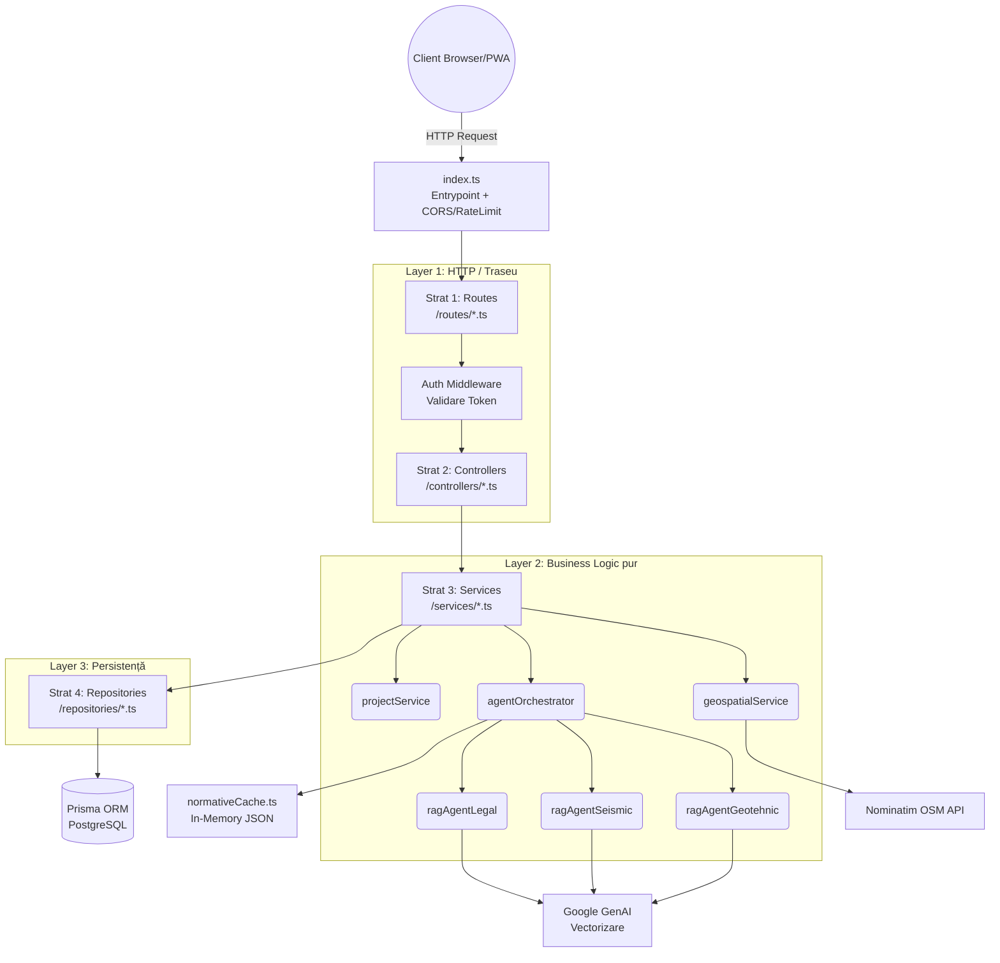

# Documentație: Faza 1 Implementată - Zidario

Acest document descrie stadiul actual al proiectului la finalizarea primei faze majore (Pregătire Teren și Configurare Casă). Detaliază arhitectura solidă a backend-ului, feature-urile deja dezvoltate, fluxul complet de viață al fișierelor și un exemplu de flow de utilizare.

---

## 1. Ce a fost implementat până acum

### 1.1. Autentificare & Securitate Avansată
- **Sistem Auth Complet**: Endpoint-uri pentru Register, Login, Refresh Token și Logout.
- **Securitate JWT**: Tokeni împărțiți pe durate logice - `accessToken` scurt (15 minute) returnat via JSON și un `refreshToken` (7 zile) trimis exclusiv într-un Cookie HttpOnly/Secure (protecție XSS).
- **Protecție Anti-Abuz (Rate Limiting Dual)**: 
  - `globalLimiter`: Limitează numărul maxim de request-uri la server, respingând orice flood sau spam.
  - `authEmailLimiter` & `authIpLimiter`: Strategie strictă pe logările eșuate care nu blochează utilizatorii nevinovați care împart același IP, dar oprește atacurile brute-force direcționate.
- **Headere Express**: Utilizarea middleware-ului `helmet` pentru headere sigure și setările de tip `cors`.

### 1.2. Setare Teren și Proiecte (Wizard 4 Pași)
- **Persistență și Structură DB (Prisma)**: O bază de date stabilă (PostgreSQL) complet scalabilă care captează detalii specifice construcției: județ, tip de sol, zonare seismică, prezență subsol, mansardă.
- **Serviciu Geospatial Inteligent (`geospatialService`)**: 
  - **Reverse Geocoding**: Traducerea coordonatelor hărții din Leaflet (lat/lng) în județ, cu ajutorul API-ului public Nominatim.
  - **Match Automat**: Preluare automată a zonei seismice și a limitei de adâncime la îngheț pe județ, direct din dicționare JSON.

### 1.3. Asistent Inteligent „Zidario” & Arhitectură Multi-Agent RAG
A fost implementată o soluție de top din zona AI, o arhitectură hibridă avansată **CAG + Multi-Agent RAG**:
- **CAG (Cache-Augmented Generation)**: Tabelele grele (zone seismice pe județ, adâncimi de îngheț, limite de suprafețe sau cerințe etaje) sunt încărcate optimizat într-un singur string la boot-ul backend-ului și furnizate asistentului AI ca set strict de reguli.
- **Multi-Agent RAG (Retrieval-Augmented Generation)**: Legislația densă este citită dinamic folosind **pgvector**, dar cu izolare completă de context. Am creat agenți specializați (Geotehnic, Seismic, Legal), fiecare interogând doar un subset specific de normative prin intermediul unui câmp `agent` din baza de date vectorizată. Astfel eliminăm complet halucinațiile AI-ului (nu va încurca reguli de izolație cu reguli de structură).
- **Proactive UX (Zero-Call AI)**: În pașii wizard-ului, asistentul injectează automat mesaje educaționale predefinite la montarea componentei. Utilizatorul este ghidat vizual cum să calculeze panta sau să recunoască tipul de sol, bazat pe norme (P100-1, NP 112), fără a declanșa apeluri costisitoare către backend/Gemini.
- **Chat cu Streaming (SSE)**: Conexiunea AI este menținută prin Server-Sent Events, livrând progresiv feedback. Asistentul dispune de **Conversation History**, astfel „Zidario” își amintește contextul de la un mesaj la altul.

### 1.4. Interfață Utilizator & Dashboard
- **Ecran ProjectDetail Elegant**: Proiectele salvate beneficiază de un ecran sumar care afișează toate deciziile de configurare (teren, seismicitate, fundație, arhitectură). Include un banner animat premium pentru funcționalitățile Fazei 2 aflate în dezvoltare (Editor Plan 2D Interactiv).

---

## 2. Arhitectura Curentă a Backend-ului

Aplicația backend aplică principiile stricte de **Layered Architecture** și **Separation of Concerns**. Fișierele au roluri unice și specifice, izolând Baza de Date de Stratul de HTTP/Web, iar logica de calcule se face intermediar.

### Cum interacționează între ele:
1. **`Routes`**: Primesc endpoint-ul. Tot aici se aplică gărzile (Ex: `protect` pentru a verifica autentificarea). Le pasează mai departe. Nu conțin logică.
2. **`Controllers`**: Extrag parametri din `req.body` sau `req.params`. Apelează un singur `Service`. Când Serviciul dă return cu un răspuns sau cu eroare, controller-ul formulează JSON-ul `res.status(200)` sau `res.status(403)`.
3. **`Services`**: Verifică logica de afaceri. Calculează câte etaje are o clădire după datele introduse. Trimit cereri de extragere la *Repository*.
4. **`Repositories`**: Aici se folosește Prisma. Se fac `findUnique`, `create`, `updateMany` sau queriuri brute SQL de similaritate vectorială pentru AI. Repositoriile doar returnează date din baza de date direct.

---

## 3. Flux Complet (Exemplu User Flow)

Vom modela traseul clar în care Utilizatorul X interacționează cu Wizard-ul și consultă AI-ul.

### 📍 Pas 1: Autentificarea
- User-ul completează Formularul de Login.
- Request-ul `POST /api/auth/login` ajunge la server.
- Express verifică limitele prin **Dual Rate Limiter** (`authEmailLimiter` apoi `authIpLimiter`).
- `authController.ts` validează intrarea, pasează la `userRepository.ts` care apelează Baza de Date cu funcția `findByEmail()`.
- Se verifică Hash-ul bcrypt, iar `authController` creează doi tokeni JWT. Cel scurt (`15m`) ajunge în răspuns. Cel lung (`7zile`) ajunge salvat automat în cookie.

### 📍 Pas 2: Pasul de Teren (Wizard)
- Odată autentificat, User-ul pe un ecran alege locația terenului dând click pe Hartă.
- React-ul face trigger pe coordonate și cheamă ruta `/api/terrain/analyze-location`.
- `terrainController` extrage latitudinea și longitudinea, invocând `geospatialService.ts`.
- Serviciul apelează interfața Nominatim. Se extrage cuvântul cheie *„Cluj”*.
- Din json-urile din backend mapate (`seismic-zones.json` și `frost-depth.json`), sistemul își dă seama că la Cluj, forța `ag` seismică este `0.10g` iar adâncimea critică de îngheț este de `90 cm`.
- Frontend-ul primește și afișează aceste date. User-ul dă "Next" -> Acestea sunt trimise pe `PATCH /api/projects/:id`. Logica de salvare trece prin `projectService` unde se filtrează input-ul (se whitelist-ează parametrii, respingând câmpurile injectate malițios de către atacatori). Apoi, `projectRepository` face direct update pe tabel.

### 📍 Pas 3: Interogarea Tehnică (Zidario AI Assistant)
- User-ul deschide asistentul Zidario și întreabă: *"Cu terenul meu din Cluj, pot construi ceva structură de zidărie dacă adaug și etaj și mansardă?"*.
- Apelul pleacă pe ruta `/api/ai/chat`. Pe lângă întrebare, front-end-ul atașează log-ul de chaturi din ultima oră și proprietățile terenului.
- Controller-ul deschide capătul de stream HTTP Server-Sent Events (SSE) (începe trimiterea header-elor cu `text/event-stream`). Apoi lasă procesarea pe seama lui `agentOrchestrator.ts`.
- Orchestratorul execută **rutarea inteligentă**: 
  1. Evaluează cuvintele cheie din întrebare (ex: "structură", "etaj") și detectează că intenția este de natură *Seismică/Structurală*.
  2. Apelează exclusiv `ragAgentSeismic`, care extrage doar din documentul P100-1 (Cod seismic) evitând bruiaje de la documente de sol sau legi de urbanism.
  3. Încarcă limitările statice de etaje și îngheț din **CAG** (`normativeCache.ts`).
- Baza de date este interogată de `normativeChunkRepository.ts` filtrând strict după `WHERE agent = 'seismic'`, folosind distanța de masă cosine (`<=>`) pentru a aduce cele mai relevante 3 pasaje din codul de proiectare.
- Prompt-ul gigant (dar invizibil utilizatorului) cuprinzând Regulile Statice, Normativele Potrivite, Istoricul Chat-ului, Variabilele curente (Județul Cluj, etc) și Întrebarea este dat lui **Gemini 2.5 Pro**.
- Pe măsură ce AI-ul Google gândește răspunsul, chunk-urile de câteva silabe vin succesiv înapoi. În bucla `for await...` din backend, fiecare părticică este trimisă cu comandă SSE nativă `res.write()` către Browser-ul User-ului, care o afișează progresiv pe ecran.
