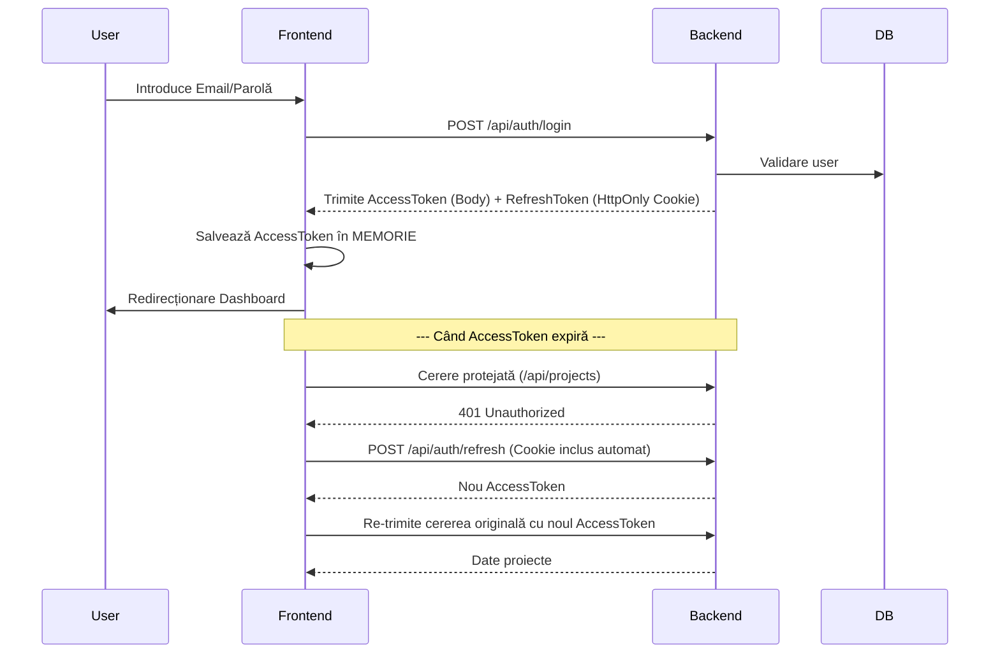

# Securitatea Frontend - BuildWise

Arhitectura de securitate a frontend-ului BuildWise este concepută pentru a proteja datele utilizatorului și a preveni atacurile comune precum XSS (Cross-Site Scripting) și CSRF (Cross-Site Request Forgery).

## 1. Gestionarea Token-urilor JWT

Sistemul folosește un mecanism de **Dublu Token**:

- **Access Token**: Este stocat **doar în memorie** (într-o variabilă locală în `axios.ts`). Acesta nu este salvat în `localStorage` sau `sessionStorage`, ceea ce îl face imun la atacurile XSS care încearcă să fure token-uri din stocarea browserului.
- **Refresh Token**: Este stocat într-un **Cookie HTTP-only** setat de backend. Acest cookie nu poate fi accesat prin JavaScript, oferind o protecție superioară.

---

## 2. Componente Cheie și Fișiere

### 🔐 [axios.ts](file:///c:/Users/Roberto/OneDrive/Desktop/Licenta/frontend/src/api/axios.ts) (Interceptorii de Securitate)
Acest fișier este inima securității API:
1. **Request Interceptor**: Adaugă automat header-ul `Authorization: Bearer <token>` la toate cererile făcute prin `apiPrivate`.
2. **Response Interceptor (Silent Refresh)**: Dacă o cerere primește eroarea `401 Unauthorized` (token expirat), interceptorul face automat o cerere ascunsă la `/auth/refresh` pentru a obține un nou Access Token folosind cookie-ul de refresh, apoi reia cererea inițială fără ca utilizatorul să observe.

### 🛡️ [AuthContext.tsx](file:///c:/Users/Roberto/OneDrive/Desktop/Licenta/frontend/src/context/AuthContext.tsx) (Managementul Sesiunii)
- **Hydration**: La fiecare refresh al paginii, `AuthContext` încearcă un "Silent Refresh" pentru a vedea dacă utilizatorul are o sesiune activă.
- **State**: Menține starea `isAuthenticated` globală în aplicație.
- **Event listener**: Ascultă evenimentul `auth:unauthorized` și forțează delogarea dacă sesiunea a expirat definitiv.

### 🚧 [ProtectedRoute.tsx](file:///c:/Users/Roberto/OneDrive/Desktop/Licenta/frontend/src/components/layout/ProtectedRoute.tsx) (Controlul Accesului)
Acest component învelește rutele private din `App.tsx`:
- Dacă un utilizator neautentificat încearcă să acceseze `/dashboard`, este redirecționat automat către `/login`.
- Reține pagina pe care utilizatorul a încercat să o acceseze pentru a-l trimite înapoi acolo după logare.

---

## 3. Fluxul de Autentificare Detaliat

---

## 4. Cele mai bune practici implementate
- **In-Memory Storage**: Protecție împotriva furtului de token-uri prin XSS.
- **HttpOnly Cookies**: Protecție pentru sesiunile pe termen lung (Refresh).
- **CSRF Protection**: Backend-ul trebuie configurat să valideze originea (CORS este deja setat pentru `http://localhost:5173`).
- **Private Routes**: Previne accesul la pagini sensibile prin manipularea URL-ului.
