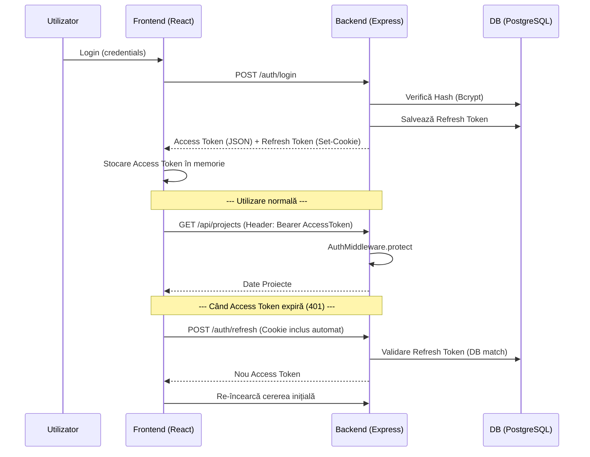

# Documentație Securitate Completă - BuildWise

Sistemul BuildWise implementează un model de securitate robust, bazat pe standarde moderne de autentificare (JWT) și bune practici în dezvoltarea web.

---

## 1. Securitatea Datelor (Backend)

### 🔑 Hashing Parole
- **Limbaj/Librărie**: TypeScript / `bcrypt`.
- **Implementare**: Parolele sunt hash-uite cu un salt de 10 runde înainte de a fi salvate în baza de date.
- **Validare la Înregistrare**: Există o validare strictă a puterii parolei (minim 8 caractere, majusculă, cifră și caracter special).

### 🎟️ Gestiunea Token-urilor JWT
Se folosește un sistem de **Dublu Token** pentru a echilibra securitatea și experiența utilizatorului:

| Tip Token | Valabilitate | Stocare Backend | Stocare Frontend |
| :--- | :--- | :--- | :--- |
| **Access Token** | 15 minute | Semnat cu `JWT_ACCESS_SECRET` | **În Memorie** (Variabilă locală) |
| **Refresh Token** | 7 zile | Salvat în tabelul `User` & Semnat | **Cookie HTTP-Only & SameSite=Strict** |

---

## 2. Arhitectura și Fișiere Cheie

### 🖥️ Backend (Logica de Server)
- **[authController.ts](file:///c:/Users/Roberto/OneDrive/Desktop/Licenta/backend/src/controllers/authController.ts)**: Gestionează fluxurile de `login`, `register`, `refresh` și `logout`.
    - La login, se trimite `accessToken` în body și `refreshToken` într-un cookie securizat.
- **[authMiddleware.ts](file:///c:/Users/Roberto/OneDrive/Desktop/Licenta/backend/src/middleware/authMiddleware.ts)**: Definește middleware-ul `protect` care verifică prezența și validitatea token-ului de acces în header-ul `Authorization`.

### 🌐 Frontend (Interfața Utilizator)
- **[axios.ts](file:///c:/Users/Roberto/OneDrive/Desktop/Licenta/frontend/src/api/axios.ts)**:
    - **Intercepor Request**: Adaugă automat header-ul de autorizare.
    - **Interceptor Response**: Detectează erorile `401` și execută automat un "Silent Refresh" folosind cookie-ul.
- **[AuthContext.tsx](file:///c:/Users/Roberto/OneDrive/Desktop/Licenta/frontend/src/context/AuthContext.tsx)**: Menține starea globală a utilizatorului și gestionează "Hydration" (verificarea sesiunii la încărcarea paginii).
- **[ProtectedRoute.tsx](file:///c:/Users/Roberto/OneDrive/Desktop/Licenta/frontend/src/components/layout/ProtectedRoute.tsx)**: Gardă de rută care previne accesul la dashboard pentru utilizatorii neautentificați.

---

## 3. Fluxul de Securitate (Schema Secvențială)

---

## 4. Protecții Împotriva Atacurilor
- **XSS (Cross-Site Scripting)**: Access Token-ul nu este în localStorage, deci nu poate fi furat prin scripturi malițioase.
- **CSRF (Cross-Site Request Forgery)**: Cookie-ul de Refresh are atributul `SameSite=Strict` și `HTTP-only`. Backend-ul permite cereri doar din originea specificată în `CORS`.
- **Brute Force**: Validarea complexității parolei și bcrypt încetinesc atacurile automate.
- **Session Hijacking**: La logout, refresh token-ul este șters atât din cookie cât și din baza de date.

---

## 5. Sinergia dintre Frontend și Backend (Cum Colaborează)

Securitatea BuildWise nu este doar o listă de reguli, ci un sistem coordonat:

1. **Orchestrarea Token-urilor**: Backend-ul decide regulile (valabilitate, hashing), dar Frontend-ul este cel care le respectă stocând Access Token-ul doar în memorie. Această colaborare asigură că, și dacă un atacator reușește să injecteze un script (XSS), acesta nu are acces la o sesiune persistentă.
2. **Silent Refresh (Colaborare în timp real)**:
    - **Backend**: Emite un `401 Unauthorized` când token-ul expiră.
    - **Frontend**: Prinde eroarea prin interceptorul Axios și cere un nou token folosind cookie-ul securizat.
    - **Backend**: Verifică cookie-ul față de baza de date și emite un nou token dacă totul este în regulă.
    - **Rezultat**: Securitate maximă fără a întrerupe lucrul utilizatorului.
3. **Logout Coordonat**: Când utilizatorul apasă "Logout", se întâmplă două lucruri simultan:
    - Frontend-ul își golește memoria locală.
    - Backend-ul invalidează fizic sesiunea în baza de date și șterge cookie-ul din browser. Această acțiune duală previne folosirea unui token de refresh furat anterior.
4. **Protecție Identitate**: Backend-ul validează complexitatea parolei, iar Frontend-ul oferă feedback vizual, asigurându-se că utilizatorul își creează un cont securizat încă de la început.
